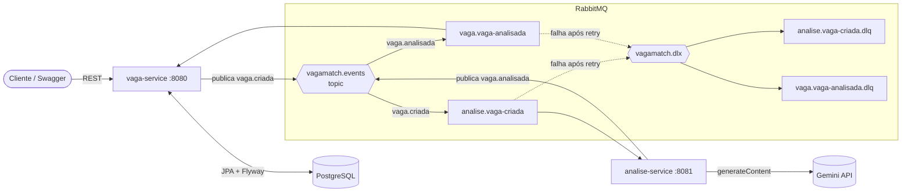
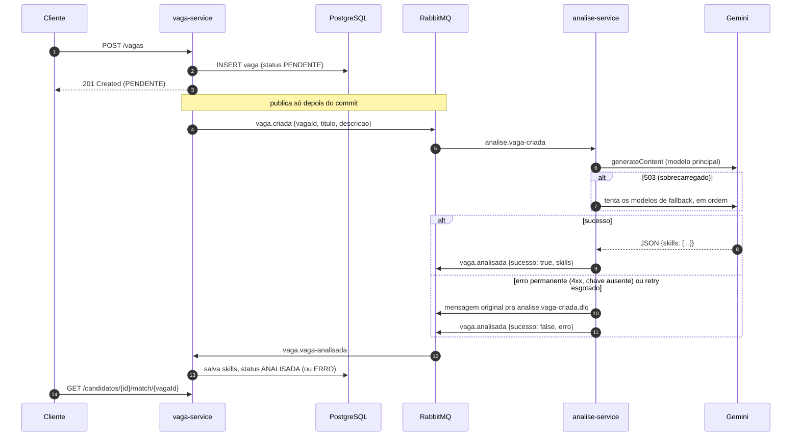

# VagaMatch

[](https://github.com/PedroSobreiraTI/vagamatch/actions/workflows/ci.yml)

Microsserviços em Java que leem a descrição de uma vaga, extraem as skills exigidas com IA (Gemini) e calculam o quanto o perfil de um candidato combina com ela: percentual de match, skills que faltam e ranking das vagas mais compatíveis.

## Arquitetura

| Serviço | Porta | Responsabilidade |
|---|---|---|
| `vaga-service` | 8080 | CRUD de vagas e candidatos, match, ranking e estatísticas. Dono do banco (PostgreSQL). |
| `analise-service` | 8081 | Consome vagas novas, chama o Gemini e devolve as skills extraídas. Não tem banco. |



### Fluxo de mensagens



## Stack

- Java 21, Spring Boot 4.1 (Web MVC, Data JPA, AMQP, Validation, Actuator)
- PostgreSQL 17 + Flyway
- RabbitMQ 4 (exchange topic, dead-letter exchange, retry com backoff)
- Gemini API (`generateContent` com `responseSchema` pra forçar JSON estruturado)
- Micrometer (métricas customizadas), springdoc-openapi (Swagger)
- JUnit 5, Mockito, AssertJ, `MockRestServiceServer`
- Docker Compose, Maven multi-módulo, GitHub Actions

## Como rodar

Pré-requisitos: Java 21, Docker e uma chave da [Gemini API](https://aistudio.google.com/apikey).

```bash
cp .env.example .env          # coloque sua GEMINI_API_KEY
docker compose up -d          # PostgreSQL + RabbitMQ

# em terminais separados
./mvnw -pl vaga-service spring-boot:run
./mvnw -pl analise-service spring-boot:run
```

No Windows, use `.\mvnw.cmd` no lugar de `./mvnw`. Os serviços leem o `.env` da raiz sozinhos; variável de ambiente real tem prioridade.

| O quê | Onde |
|---|---|
| Swagger | http://localhost:8080/swagger-ui.html |
| Health | http://localhost:8080/actuator/health e http://localhost:8081/actuator/health |
| Métricas | http://localhost:8080/actuator/metrics |
| Painel do RabbitMQ | http://localhost:15672 (usuário/senha do `.env`) |

Testes: `./mvnw -B verify` (não precisa de banco, broker nem chave).

### Variáveis de ambiente

| Variável | Padrão | Uso |
|---|---|---|
| `GEMINI_API_KEY` | — | Chave da Gemini API (obrigatória pra análise) |
| `GEMINI_MODEL` | `gemini-3.5-flash` | Modelo principal |
| `GEMINI_FALLBACK_MODELS` | `gemini-3.5-flash-lite,gemini-2.5-flash` | Modelos tentados quando o principal responde 503 |
| `DB_NAME`, `DB_USER`, `DB_PASSWORD`, `DB_HOST` | `vagamatch` / `localhost` | PostgreSQL |
| `RABBIT_USER`, `RABBIT_PASSWORD`, `RABBIT_HOST` | `vagamatch` / `localhost` | RabbitMQ |

## Exemplos de uso

**1. Cadastrar uma vaga.** Ela nasce `PENDENTE` e é analisada em segundo plano.

```bash
curl -s -X POST localhost:8080/vagas -H 'Content-Type: application/json' -d '{
  "titulo": "Desenvolvedor Backend Java",
  "empresa": "Acme",
  "descricao": "Requisitos: Java, Spring Boot e PostgreSQL. Diferencial: Docker."
}'
```

**2. Consultar a vaga** depois de alguns segundos:

```bash
curl -s localhost:8080/vagas/1
```

```json
{
  "id": 1,
  "titulo": "Desenvolvedor Backend Java",
  "status": "ANALISADA",
  "skills": [
    { "nome": "Docker", "categoria": "DEVOPS", "obrigatoria": false },
    { "nome": "Java", "categoria": "LINGUAGEM", "obrigatoria": true },
    { "nome": "PostgreSQL", "categoria": "BANCO_DE_DADOS", "obrigatoria": true },
    { "nome": "Spring Boot", "categoria": "FRAMEWORK", "obrigatoria": true }
  ]
}
```

**3. Cadastrar um candidato e suas skills** (nível de 1 a 5):

```bash
curl -s -X POST localhost:8080/candidatos -H 'Content-Type: application/json' \
  -d '{"nome": "Ana", "email": "ana@exemplo.com"}'

curl -s -X PUT localhost:8080/candidatos/1/skills -H 'Content-Type: application/json' \
  -d '[{"nome": "Java", "nivel": 4}, {"nome": "Spring Boot", "nivel": 3}]'
```

**4. Match do candidato com a vaga.** Obrigatória pesa 2, diferencial pesa 1: ela tem 4 dos 7 pontos.

```bash
curl -s localhost:8080/candidatos/1/match/1
```

```json
{
  "candidatoId": 1,
  "vagaId": 1,
  "tituloVaga": "Desenvolvedor Backend Java",
  "percentual": 57,
  "atendeTodasObrigatorias": false,
  "skillsAtendidas": ["Java", "Spring Boot"],
  "obrigatoriasFaltando": ["PostgreSQL"],
  "diferenciaisFaltando": ["Docker"]
}
```

Vaga ainda `PENDENTE` ou com `ERRO` na análise devolve `409 Conflict` (ProblemDetail).

**5. Vagas recomendadas** (ranking por match, paginado):

```bash
curl -s 'localhost:8080/candidatos/1/vagas-recomendadas?page=0&size=10'
```

**6. Skills mais pedidas** nas vagas analisadas:

```bash
curl -s 'localhost:8080/estatisticas/skills?limite=5'
```

Outros endpoints (CRUD completo de vagas e candidatos, `GET /skills`) estão no Swagger.

## Decisões técnicas

**Publicação depois do commit.** O `VagaService` não fala com o RabbitMQ: ele publica um evento interno do Spring, e o `VagaEventPublisher` (`@TransactionalEventListener(phase = AFTER_COMMIT)`) manda `vaga.criada` só depois do commit. Se publicasse dentro da transação, o analise-service poderia responder antes de a vaga existir no banco, ou a transação poderia dar rollback com a mensagem já enviada. Se o broker estiver fora, o cadastro não quebra: a vaga fica `PENDENTE`.

**Idempotência no consumidor.** O RabbitMQ garante entrega *pelo menos uma vez*, então `vaga.analisada` pode chegar repetida. O vaga-service só aplica o resultado se a vaga ainda estiver `PENDENTE`; mensagem repetida ou de vaga removida é ignorada e registrada no log. As skills extraídas são deduplicadas sem diferenciar maiúscula (o Gemini pode devolver "Java" e "java"); se aparecer duas vezes, vale como obrigatória.

**Retry e DLQ.** Cada fila tem uma dead-letter queue (`*.dlq`) via `vagamatch.dlx`. O listener tenta 3 vezes (backoff de 2s e 4s). Esgotou, o `FalhaAnaliseRecoverer` republica a mensagem original na DLQ, com o stack trace nos headers, e avisa o vaga-service com `sucesso: false` pra vaga ir pra `ERRO` em vez de ficar `PENDENTE` pra sempre. Erro permanente (4xx, chave ausente) vira `GeminiPermanenteException` e pula o retry: um `RabbitListenerRetrySettingsCustomizer` define um predicate que procura essa exceção na cadeia de causas. O 429 (rate limit) continua com retry, assim como 5xx e timeout.

**Fallback de modelo.** O Gemini responde 503 quando um modelo está sobrecarregado. Nesse caso, o `GeminiService` tenta os modelos de `GEMINI_FALLBACK_MODELS` em ordem, na mesma tentativa. Só o 503 troca de modelo: outros erros já dizem algo sobre a requisição, e trocar de modelo não ajuda. Timeout de 15s por chamada.

**Query agregada no ranking.** As vagas recomendadas são calculadas no PostgreSQL com uma query nativa: `LEFT JOIN` das skills da vaga com as do candidato, `SUM` dos pesos e `GROUP BY` por vaga. A paginação é real (`LIMIT/OFFSET` no banco) em vez de carregar todas as vagas na memória. Os pesos vêm por parâmetro da `CalculadoraMatch`, então a regra fica num lugar só: o endpoint de detalhe usa a mesma classe em Java.

**Outras escolhas**
- Saída estruturada do Gemini com `responseSchema` (enum de categorias), sem parsing de texto livre.
- Chave da API no header `x-goog-api-key`, nunca na URL (não vaza em log).
- `ddl-auto: validate`: o schema é das migrations Flyway e as entidades precisam bater com ele.
- Métricas: `vagamatch.vagas.analisadas{resultado}`, `vagamatch.vagas.pendentes` (gauge) e `vagamatch.match.calculos{tipo}`.

## Limitações conhecidas

- **Sinônimos não casam:** "API REST" e "REST API" viram skills diferentes. Ideia: tabela de aliases.
- **Nível do candidato fora do cálculo:** a vaga não diz que nível exige, então o match só olha se o candidato tem a skill.
- **Sem outbox:** se o RabbitMQ estiver fora no momento do cadastro, a vaga fica `PENDENTE` e não há reenvio automático. Editar a vaga (`PUT`) também não dispara nova análise.
- **Reprocessamento manual:** mensagens na DLQ e vagas em `ERRO` precisam ser reenviadas pelo painel do RabbitMQ.
- **Só testes de unidade:** não há testes de integração com PostgreSQL/RabbitMQ reais (próximo passo: Testcontainers).
- **Sem autenticação** na API.

## Fluxo de branches

Git Flow: `main` (versões estáveis), `develop` (integração) e uma `feature/*` por etapa. Commits em Conventional Commits.
